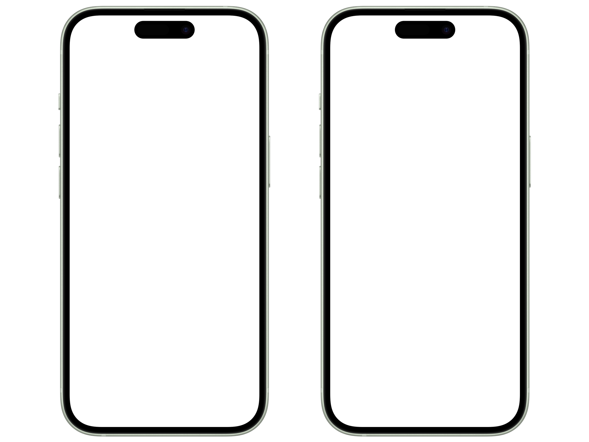
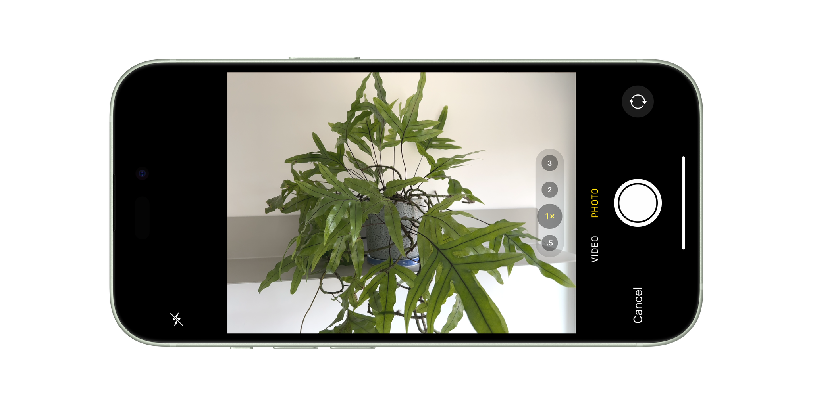

# `Snap`

__Point-and-shoot camera for iOS apps__

A single-lens, single-use alternative to `UIImagePickerController`, `Snap` covers the most common in-app picture-taking use case. Zero configuration, unless you want to pick a different lens or enable the flash. Takes one auto-focused JPEG at a time.

### Supported Platforms

Written in [Swift](https://developer.apple.com/swift) 5.10 for [iOS](https://developer.apple.com/ios) 17. Build with [Xcode](https://developer.apple.com/xcode) 15 or newer.

## Ready to Use



Present `Snap.Camera` using one of two included view modifiers for sheet and full-screen-cover modal presentations:

```swift
import SwiftUI
import Snap

struct ContentView: View {
    @State var isPresented: Bool = false
    @State var isCapturing: Bool = false
    @State var image: Camera.Image?
    
    var body: some View {
        VStack {
            Image(image)
                .resizable()
                .aspectRatio(contentMode: .fit)
            Button(action: { isPresented.toggle() }) {
                Label("Camera", systemImage: "camera")
            }
            .sheet($isPresented) {
                Camera($isCapturing) { image in
                    self.image = image
                    isPresented.toggle()
                }
            }
        }
    }
}
```

Toggle `$isCapturing` true to trigger the shutter programmatically. Captured still images are delivered as `Data` with `UTType public.jpeg`.

`Snap.Camera` automatically selects the 1x-iest built-in rear camera available. Easily flip that to front-facing camera or pick your own:

```swift
Camera.device = .default() // .default(.back)
Camera.device = .default(.front)
Camera.device = Camera.Device([
    .builtInDualCamera,
    .builtInWideAngleCamera // Select first available
], position: .back)

Camera.quality = .balanced // Default
Camera.quality = .speed 
Camera.quality = .quality

Camera.flash = .off // Default
Camera.flash = .auto
```

⚠️ Add a [privacy description](https://developer.apple.com/documentation/uikit/protecting_the_user_s_privacy/requesting_access_to_protected_resources) for camera usage to the main app target info.

## Kit of Parts

### `Camera`

`Camera` holds the core functionality:

* Interface binding to trigger the camera shutter
* Handler to deliver a JPEG image of the configured quality, using the configured camera
* Live video preview that scales to fill its SwiftUI containing view
* Video preview flashes to indicate shutter release

Use `Camera.shutterToggle(_ alignment: Alignment)` modifier to add a shutter button:

```swift
@State var isCapturing: Bool = false
@State var error: Error? = nil

Camera($isCapturing, error: $error) { image in
    // image.fileType: public.jpeg
    // image.data: 2901515 bytes
}
.shutterToggle() // Default alignment: .bottom
```

### `DisableIdleTimer`

The `Snap.Camera` sheet/full-screen presentations use a handy `ViewModifier` to keep the screen awake:

```swift
import Snap

EmptyView()
    .disableIdleTimer() // .disableIdleTimer(300.0)
    .disableIdleTimer(86400.0) // Lowest value wins
```

### `ImagePicker`

SwiftUI is gonna get a first-party camera `Picker` of some kind _eventually_. In the meantime, `ImagePicker` wraps [`UIImagePickerController`](https://developer.apple.com/documentation/uikit/uiimagepickercontroller) for when you need features that `Snap.Camera` doesn't cover:

* User-adjustable zoom and flash
* Review, edit and retake
* Hardware volume button shutter release
* Movie recording



Present `ImagePicker` with the included view modifier, then handle any captured media:

```swift
import Snap

@State private var isPresented: Bool = false

Button(action: { isPresented.toggle() }) {
    Label("Camera", systemImage: "camera")
}
.imagePicker($isPresented, media: [.image, .movie]) { info in
    // info: [UIImagePickerController.InfoKey: Any]
}
```

⚠️ `UIImagePickerController` is designed to be locked in portrait orientation only, but `UIViewControllerRepresentable` ignores view controller orientation locking. Hilarity ensues _unless_ your app is portrait only. Otherwise, stick to presenting from UIKit for now.

⚠️ Enabling movie capture in `ImagePicker` or `UIImagePickerController` requires an additional target info privacy description for microphone usage.
